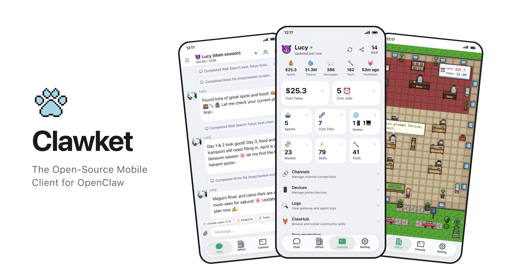

<p align="center">
  
</p>

# Clawket

[](https://www.npmjs.com/package/@p697/clawket)
[](LICENSE)
[Follow on X](https://x.com/cavano697)

[English README](./README.md)

Clawket 是一个开源的移动端应用，用来随时随地管理你的 [OpenClaw](https://github.com/openclaw/openclaw) AI Agent。支持 [iOS](https://apps.apple.com/app/id6759597015) 和 Android。

## 核心特性

- **📱 OpenClaw 移动端** — 聊天、管理 Agent、配置模型、设置定时任务、监控 Session，全部在手机上完成
- **🔒 默认安全** — Token 认证 + TLS 加密传输，Relay 和直连模式均支持
- **🌐 灵活连接** — 支持云端 Relay、局域网直连、Tailscale，无需端口转发
- **🖥️ 完整远程控制台** — 管理 Agent、Channel、Skill、文件、设备、日志，不用碰终端
- **🏗️ 可自托管** — 自建 Relay 基础设施，或跳过它直接局域网 / Tailscale 直连
- **📦 开源 Monorepo** — 移动端（Expo/React Native）、Relay Workers（Cloudflare）、Bridge CLI，一个仓库，从源码构建

## 架构

```text
┌──────────────┐        pairing / control         ┌──────────────────┐
│ mobile app   │ ◄──────────────────────────────► │ bridge CLI/runtime│
└──────────────┘                                   └──────────────────┘
        │                                                   │
        │ pair / claim / verify                             │ local gateway control
        ▼                                                   ▼
┌──────────────────┐     route / auth / websocket    ┌──────────────┐
│ relay-registry   │ ◄─────────────────────────────► │ relay-worker │
└──────────────────┘                                  └──────────────┘
```

Clawket 支持两种连接方式：

- **Relay 模式** — 使用 `relay-registry` + `relay-worker`，适合云端转发和自动配对。
- **直连模式** — 通过局域网 IP、Tailscale IP 或自定义 gateway URL 直连，不需要部署 relay 基础设施。

## 工作方式

1. 在你的 Mac/PC 上运行 `clawket pair`，Bridge 会生成一个限时一次性二维码用于 Relay 配对。也可以运行 `clawket pair --local` 通过局域网直连配对，无需任何 Relay 基础设施。
2. 用 Clawket App 扫描二维码，信任该设备。
3. Relay 模式下，Registry 校验配对，Relay Worker 在手机和 Bridge 之间实时转发 WebSocket 流量。
4. 直连模式下，App 通过局域网或 Tailscale 直连 Gateway，不需要 Relay。
5. Bridge 把所有请求转发到本地 OpenClaw 主机。聊天、管理 Agent、编辑配置——全部在手机上实时完成。
6. 首次配对后，后续重连自动完成。

## 仓库结构

| 路径 | 说明 |
|------|------|
| `apps/mobile` | Expo / React Native 移动端 |
| `apps/relay-registry` | Cloudflare Registry Worker |
| `apps/relay-worker` | Cloudflare Relay Worker |
| `apps/bridge-cli` | 可发布的 `@p697/clawket` Bridge CLI |
| `packages/bridge-core` | Pairing / Config / Service 共享能力 |
| `packages/bridge-runtime` | Bridge Runtime |
| `packages/relay-shared` | Relay 共享协议与类型 |

## 快速开始

如果你只是想先在本地把移动端跑起来，从这里开始即可。你不需要先理解 Relay、Registry，也不需要先从源码构建 bridge。

### 运行移动端

在 macOS 上运行 iOS 开发版：

```bash
npm install
npm run mobile:sync:native
npm run mobile:dev:ios
```

运行 Android 开发版：

```bash
npm install
npm run mobile:sync:native
npm run mobile:dev:android
```

### 连接到 OpenClaw

如果你已经通过 npm 安装了官方发布的 bridge CLI，可以单独完成配对：

```bash
npm install -g @p697/clawket
clawket pair
```

如果你不想部署 relay，直接走本地配对：

```bash
clawket pair --local
```

然后在 App 里扫描生成的二维码即可。

### 什么时候继续往下看？

- 如果你只是想把移动端跑起来，上面的命令已经够用。
- 如果你要自托管 Relay / Registry，或者要从源码构建 bridge，请继续看后面的 self-hosting 文档。

### Relay / Registry

1. 复制本地 Cloudflare 配置模板：

```bash
cp apps/relay-registry/wrangler.local.example.toml apps/relay-registry/wrangler.local.toml
cp apps/relay-worker/wrangler.local.example.toml apps/relay-worker/wrangler.local.toml
```

2. 填入你自己的账号相关配置。
3. 启动本地 Worker：

```bash
npm run relay:dev:registry
npm run relay:dev:worker
```

### Bridge

Relay 模式，让 Bridge 对接你自己的 Registry：

```bash
npm run bridge:pair -- --server https://registry.example.com
```

或者：

```bash
CLAWKET_REGISTRY_URL=https://registry.example.com npm run bridge:pair
```

不部署 Relay，直接走本地配对：

```bash
npm run bridge:pair:local
```

显式指定 LAN、Tailscale 或自定义 Gateway URL：

```bash
npm run bridge:pair -- --local --url ws://100.x.x.x:18789
```

## 移动端配置

如果你只是想用默认的开源配置把 App 跑起来，可以先忽略这一节。

可选的 App 配置位于 [`apps/mobile/.env.example`](./apps/mobile/.env.example)。只有当你要为自己的构建定制公开配置时，才需要复制为 `.env.local`，例如 docs 链接、support 链接、legal 链接或其他可选集成。

如果这些值留空，App 会保持开源仓库默认的安全行为，并自动隐藏未配置的可选集成。

查看或校验当前配置：

```bash
npm run mobile:config:show
npm run mobile:config:check
```

在 Xcode 中直接 Build / Archive 时，bundling 阶段会自动读取 `.env`、`.env.local`、`ios/.xcode.env`、`ios/.xcode.env.local`，因此 `EXPO_PUBLIC_*` 值无需额外脚本即可注入。

## 前置要求

按你的目标准备对应环境即可：

- 本地运行 iOS App：macOS、Xcode、Node.js 20+、npm
- 本地运行 Android App：Node.js 20+、npm、Android Studio
- 使用官方发布的 bridge CLI：Node.js 20+、npm
- 运行 relay 基础设施：Cloudflare 账号

## 自托管

Clawket 的公共仓库默认就可以 clone 下来自行运行，不依赖官方托管后端。你既可以使用自己运营的 Relay 模式，也可以直接使用 LAN、Tailscale 或自定义 URL 的直连模式。

自托管关键默认行为：

- `clawket pair` 需要 `--server` 或 `CLAWKET_REGISTRY_URL` — 没有硬编码的 Registry
- `clawket pair --local` 无需任何 Cloudflare 基础设施
- 仓库里的 `wrangler.toml` 只保留占位绑定和 `example.com` 端点
- 如果 analytics、support、legal 等值为空，App 会自动隐藏或禁用对应集成
- 如果 RevenueCat 未配置，App 会跳过订阅计费并默认解锁 Pro

完整的分发边界说明请阅读 [SELF_HOSTING_MODEL.md](./SELF_HOSTING_MODEL.md)。

### 自托管文档

- [docs/self-hosting.md](./docs/self-hosting.md)
- [docs/relay/CONFIGURATION.md](./docs/relay/CONFIGURATION.md)
- [docs/relay/LOCAL-DEVELOPMENT.md](./docs/relay/LOCAL-DEVELOPMENT.md)
- [docs/relay/ARCHITECTURE.md](./docs/relay/ARCHITECTURE.md)

## 验证

如果你只是想确认移动端能在本地跑起来，先执行：

```bash
npm run mobile:config:check:ios
npm run mobile:test -- --runInBand
```

如果你是在检查整个仓库，或者为开源发布做完整验证，再执行更全面的检查：

```bash
npm run typecheck
npm run test
```

如果你要验证完整连接链路：

```bash
npm run mobile:config:check:ios
npm run relay:test
npm run bridge:test
```

然后再手动验证真实链路：配对 Bridge、启动 App、扫描配对数据、确认链路走的是你自己的端点。

## 贡献

请阅读 [CONTRIBUTING.md](./CONTRIBUTING.md)。

## 安全

请阅读 [SECURITY.md](./SECURITY.md)。

## 许可证

除非某个子目录另有说明，本仓库默认采用 [AGPL-3.0-only](./LICENSE) 许可证。

目录 [`apps/mobile/modules/clawket-speech-recognition`](./apps/mobile/modules/clawket-speech-recognition) 不包含在根目录 AGPL 授权范围内，继续按其本地许可证声明作为专有组件处理。
